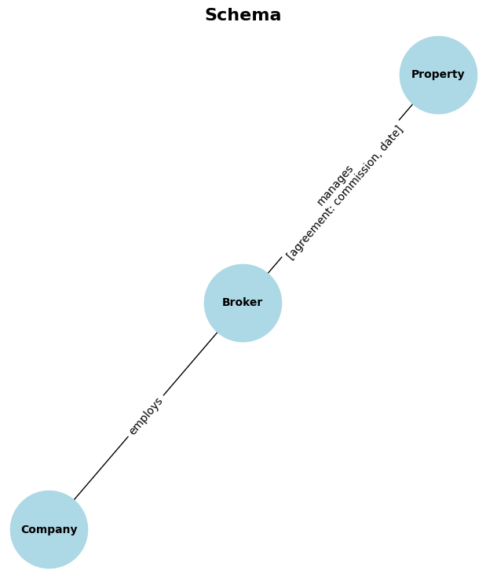

<!-- 

for config see: https://pandoc.org/chunkedhtml-demo/6.2-variables.html

$ pandoc report.md -o report.pdf && open report.pdf

merge pdfs:

$ rm -rf output.pdf && gs -q -dNOPAUSE -dBATCH -sDEVICE=pdfwrite -sOutputFile=output.pdf report-header.pdf report.pdf

-->

<!--

- deadline 30. september
- learning objectives: https://kg.dbai.tuwien.ac.at/kg-course/details/
- assessment: https://kg.dbai.tuwien.ac.at/kg-course/organization/#:~:text=Going%20to%20be-,Assessed,-%3F
- 6 page report

-->

Despite the vast amount of online real estate data available, traditional analysis methods often fail to uncover hidden relationships and insights, leaving investors and homebuyers with incomplete information. Knowledge graphs offer a powerful solution, enabling the integration and analysis of diverse data sources to reveal complex patterns and connections that inform smarter investment decisions.

Cardorel et al.[^geospacial] for instance show how promising this technology is by proposing a new approach to represent uncertain geospatial information in knowledge graphs. This approach enables the integration of geospatial data into knowledge graphs, allowing users to query and analyze location-based information more effectively.

However, due to the novelty of this approach both in academia and industry many stakeholders remain unaware of its potential.

#### (L11) Provided Service

By conducting a comprehensive case study — from data scraping and preprocessing to advanced graph analytics — we aim to provide a practical framework that showcases this technology's capabilities and motivate further research in this area. We aim to provide a reproducible and easy-to-follow guide for other researchers and practitioners interested.

The academic nature of this project however doesn't undermine its practical value. Through increased automation and fault tolerance this project should suffice for giving any data driven real estate investor an edge in the market. The provided service lies in parsing the output of a soft real-time scraper in a graph database and thus opening up the possibility of real-time semantic and knowledge-based analysis of the real estate market in Vienna.

# 1. Mining Real Estate Data

To build a comprehensive knowledge graph for real estate analysis in Vienna, we begin by identifying the most valuable data sources. Willhaben emerges as the top candidate, offering 435 high-quality property listings and boasting a significant traffic volume of 1.7 million monthly visitors, primarily from Austria. This platform provides a robust foundation for our data collection efforts.

While other websites like Immoscout and Wohnungsboerse offer a substantial number of listings, they often duplicate content or cater primarily to the German market based on their traffic estimates of 9.1 million and 589.2k monthly visitors, respectively from Ahrefs. This makes them less suitable for our Vienna-focused analysis. Websites such as Immowelt, Immodirekt and Immobilien.net provide similar options to Willhaben but with lower traffic volumes, making them less ideal as primary data sources. Some platforms, including Immmo and Immosuchmaschine, present challenges due to broken links or redirect issues, compromising data quality and accessibility. Others, like Findmyhome.at and Projekt Promotion, suffer from poor user interfaces or lack of transparent pricing information, further complicating data extraction. Remax and Immosky, while offering high-quality listings, have limited options available, reducing their value for comprehensive analysis. "Erste Bank" and "Engel und Völkers" have even fewer listings in the desired price range, making them less suitable for our purposes.

To address the technical challenges of web scraping real estate data, we implemented a three-stage approach. The initial stage utilizes `asyncio` and `aiohttp` for efficient, concurrent URL collection[^speedup] The second stage employs `Playwright` with `stealth` plugins to navigate search results pages, mimicking human behavior to avoid detection. The final stage uses asynchronous requests with retry logic and rate limiting to extract detailed property information.
Throughout the process, we implemented measures to overcome common obstacles such as DDoS protection and rate limiting. These include using rotating IP addresses, randomized delays between requests and gradual page scrolling. The use of `Playwright` with `stealth` plugins proved particularly effective in avoiding detection, offering superior capabilities compared to traditional scraping methods. Data extraction is performed using `BeautifulSoup4`, with results stored in CSV and JSONL formats to accommodate varying property attributes. This approach allows for flexible schema and efficient data processing. By combining these techniques, we created a robust scraping system capable of gathering comprehensive real estate data while minimizing the risk of being blocked or rate-limited.

This data collection and structuring process sets the stage for the subsequent stages of our case study.

# 2. Preprocessing and Structuring

We begin our data preprocessing and structuring phase by implementing a series of Python functions to clean and normalize the collected real estate data. Our approach focuses on parsing and standardizing various fields to ensure consistency across all property listings. To ensure data quality and relevance, we implement a threshold-based filtering system using the `get_available_keys` function. This allows us to focus on fields that are consistently populated across listings, improving the overall reliability of our dataset. We set an arbitrary threshold of 5% presence across all listings to determine which fields to retain. In the process of structuring our data, we also generate unique identifiers for properties and brokers when this information is missing from the original listing. This step is crucial for maintaining data integrity. To prepare the data for database migration, we perform several key transformations. We rename fields to more standardized and descriptive names, remove special characters and convert keys to lowercase for consistency. We also translate German umlauts to their equivalent ASCII representations to avoid potential encoding issues.

#### (LO4) Temporal Data and other Models

Finally, we output the processed data to a CSV file, which serves as an intermediate format suitable for importing into graph database systems like Neo4j. This approach allows for flexible schema adjustments and efficient data processing in subsequent stages of our analysis. At this stage we have successfully parsed data from the semantic web structure HTML served by Willhaben into a much more analytics-friendly format. However it's worth mentioning that there are other models that could be used to represent the data. For example, given that each of our listings has a timestamp associated with it, we could use a temporal graph model to represent the data. This would allow us to track changes in the real estate market over time and analyze trends and patterns in the data. Temporal graph models are particularly useful for time-series data analysis and can provide valuable insights into how the real estate market evolves over time. By incorporating temporal data into our knowledge graph, we can gain a deeper understanding of the dynamics of the real estate market and make more informed decisions based on historical trends and patterns. Due to time constraints, we were unable to implement a temporal graph model in this case study. However, this is an area that could be explored in future research to enhance the analysis of real estate data using knowledge graphs.

By implementing these preprocessing and structuring steps, we ensure that our real estate data is clean, consistent and properly formatted for the next phase of our case study: the creation and analysis of a knowledge graph.

# 3. Building a Knowledge Graph

After validating the CSV keys we proceed in outlining the entities and relationships. By defining the schema of our knowledge graph, we establish the foundation for our data model. We identify key entities such as `Property`, `Broker`, `Property` and do not consider individual entity features such as `Price` or `Location` as entities themselves to avoid redundancy. The relationships between the nodes `employs` and `manages` are despite linguistically not being bijections used for undirected edges. Furthermore we store the broker agreement features in the `manages` relationship as this is a property of the relationship and not the broker itself. This schema is then used to create the nodes and relationships in the Neo4j database.



#### (LO5) Choosing a KG system

Neo4j was chosen as the database system for this case study due to its native support for graph data structures, intuitive Cypher PLang syntax, efficient querying capabilities and most importantly native dockerized support for knowledge graphs with the recently released GDS (Graph Data Science) library that comes with a plethora of embedding and machine learning algorithms baked right into the Java runtime. This way we can avoid any overhead caused by data remigration between different systems and formats. This makes Neo4j an ideal choice for building and analyzing knowledge graphs, especially for real estate data analysis.

While Neo4j is a powerful tool for building knowledge graphs, there are other graph database systems available that could also be used for this purpose. For example, Amazon Neptune, Microsoft Azure Cosmos DB and TigerGraph are all popular graph database systems that offer similar functionality to Neo4j. Each of these systems has its own strengths and weaknesses and the choice of database system will depend on the specific requirements of the project. In this case study, Neo4j was chosen for its ease of use, flexibility and performance, making it an ideal choice for building and analyzing the real estate knowledge graph.

#### (LO7, 08) Creating and modifying a Knowledge Graph

Our implementation begins by initializing the database connection and preparing the input data. We locate the most recent CSV file in the specified directory, read its contents and convert them into a list of dictionaries for easier manipulation and format conversion. The core of our implementation lies in the `init_db` function, which is responsible for creating nodes and relationships in the graph. We iterate through each dictionary in our dataset, creating or updating nodes for companies, brokers and properties. For each entity type, we use Cypher's `MERGE` command to ensure that we do not create duplicate nodes. This is particularly important for maintaining data integrity in our knowledge graph. Our implementation makes use of parameterized Cypher queries to prevent SQL injection and improve query performance. We also employ conditional setting of relationship properties to handle cases where certain data fields may be null or empty.

To ensure data freshness and avoid conflicts with previous runs, we include a step to clear the existing database before populating it with new data. This is achieved through a Cypher query that detaches and deletes all nodes in the graph.

The entire process is wrapped in a timed execution block, allowing us to measure the performance of our database operations. This can be valuable for optimizing our implementation as the dataset grows or as we introduce more complex queries.

By structuring our data in this graph format, we create a rich, interconnected representation of our real estate domain.

# 4. Logical Inference and Analysis

We now turn our attention to the logical inference and analysis phase of our project, leveraging the power of our knowledge graph to extract meaningful insights from the real estate data. Our approach involves crafting a series of Cypher queries to answer specific questions about the real estate market in Vienna.

We begin by examining the market share of companies in Vienna's property market. Our query calculates the proportion of properties managed by each company relative to the total number of properties in the database. This provides us with a clear picture of which companies dominate the market and to what extent.

```
"company","share"
"winegg makler gmbh",0.006415495032716801
"3si makler gmbh",0.00528138672537345
"ehl wohnen gmbh",0.0050756906108062735
"immocontract immobilien vermittlung gmbh",0.004758807407283866
"alexander ringsmuth gmbh",0.0036191397454927534
...
```

Next, we dig deeper into the geographical distribution of properties by analyzing the market share of companies within each district of Vienna. This granular view allows us to identify companies that may have a strong presence in specific areas of the city, potentially indicating local market specialization or strategic focus.

```
"shares","district"
"[{'share': 0.011083123425692695, 'company': 'piment immobilien & investment gmbh'}, ...]","1010"
"[{'share': 0.010235165102960887, 'company': 'ehl wohnen gmbh'}, ... ]","1020"
"[{'share': 0.021883186931730622, 'company': 'otto immobilien wohnen'}, ...]","1030"
...
```

To assess the financial strength of the companies in our database, we calculate their net worth based on the total value of properties they manage. This metric provides insight into the scale of each company's property portfolio and its potential market influence.

```
"company","net_worth"
"t19-re real estate gmbh & co kg # vendita gmbh",41539619303.20109
"ehl wohnen gmbh",41492065622.29978
"winegg makler gmbh",40188689564.48008
"immocontract immobilien vermittlung gmbh",35002228586.70145
"haring immobilientreuhand gmbh",30025864376.0
...
```

Shifting our focus to individual brokers, we analyze their market share across the city. This analysis helps us identify the most prolific brokers in Vienna's real estate market. We also examine broker performance within each company, allowing us to understand how broker success may vary across different organizations.

```
"broker","share"
"unknown",0.02882065185359816
"kevin matyas",0.01779925738197678
"haring immobilien treuhand gmbh",0.01744562975187128
"julian kukacka",0.013025284375552544
"mag. fh thomas schwarz",0.012318029115341545
...
```

To gain a more comprehensive view of broker performance, we calculate a performance ranking based on total commission earned and the number of properties managed. This metric provides insight into both the volume and value of transactions handled by each broker.

```
"broker","total_commission","properties_managed","avg_commission_per_property"
"engel & völkers wien mmc",220796901375.0,69,3199955092.3913045
"frau sonja kaspar und herr massimo saccomanno",197640660693.0,45,4392014682.066667
"jana cocoglia",170719935693.0,13,13132302745.615385
"frau elisabeth papsch und herr massimo saccomanno",149414235900.0,20,7470711795.0
"di lisa moosbrugger",105149955300.0,7,15021422185.714285
...
```

We also investigate the efficiency of companies in utilizing their brokers by calculating a ratio of properties managed per broker employed. This efficiency metric offers insight into the operational strategies of different companies and may indicate varying approaches to resource allocation.

```
"company","broker_count","property_count","efficiency_ratio"
"michaela-christina moser",1,489,489.0
"margarete",1,489,489.0
"alexander",1,489,489.0
"benjamin forster",1,489,489.0
"familie fiori",1,489,489.0
...
```

Finally, we explore the relationship between property prices and features across different districts. By calculating average property prices for each district and identifying the most common features in high-value areas, we can discern patterns that may influence property valuation.

```
"district","avg_price","top_features"
"1010",3468854.4897959204,"[('terrasse', 77), ('balkon', 45), ('loggia', 42), ...]"
"1190",1061942.7507511207,"[('terrasse', 408), ('balkon', 331), ('garten', 267) ,...]"
"1040",882829.6959466664,"[('balkon', 151), ('terrasse', 85), ('loggia', 59), ...]"
"1070",881468.1000803215,"[('terrasse', 64), ('balkon', 46), ('garten', 29), ...]"
"1130",871185.3400641031,"[('terrasse', 225), ('balkon', 200), ('garten', 147), ...]"
...
```

#### (LO2) Logical Inference

Throughout our analysis, we employ various aggregation techniques, such as COUNT, SUM, and AVG, to derive meaningful statistics from our data. We also make use of Cypher's powerful graph traversal capabilities to explore relationships between different entities in our knowledge graph. The results of these queries are stored in CSV files for further analysis and visualization. This approach allows us to easily share our findings and integrate them with other data analysis tools if needed.

# 5. Embeddings and Machine Learning

We proceed with our analysis by implementing embeddings and machine learning techniques to extract deeper insights from our knowledge graph. Our focus is on computing similarities between companies based on their property management relationships. We begin by projecting a subgraph from our main graph, which we name "company-property-graph". This projection includes nodes representing companies and properties, as well as edges representing the management relationships between them. We use Cypher queries to define the nodes and relationships for this projection, ensuring that we capture the relevant data for our analysis.

#### (LO1) Embeddings

After projecting the graph, we apply the Node Similarity algorithm provided by the Graph Data Science (GDS) library. This algorithm computes the similarity between nodes based on their neighborhood structure. We set a similarity threshold of `0.1` to filter out weak similarities and focus on the most significant relationships. The algorithm writes the similarity scores as properties of new "SIMILAR" relationships between company nodes.

To make the results more interpretable, we stream the similarity data and convert the node IDs back to company names using a Cypher query. This step allows us to present the results in a more human-readable format, with company names instead of internal node identifiers.

The resulting dataframe contains pairs of companies and their similarity scores, sorted in descending order of similarity. This provides us with a clear view of which companies have the most similar property management profiles.

```
company1,company2,similarity
moritz immobilien,moritz immobilien,1.0
realbrokers dienstleistungs gmbh & co kg,winegg makler gmbh,0.9942857142857143
immocity real estate gmbh,immocity real estate gmbh,0.986013986013986
fairin og,winegg makler gmbh,0.9818181818181818
```

# 6. Conclusion

This project has been a valuable learning experience in the application of knowledge graphs to real estate data analysis. Due to time constraints we were only able to scratch the surface of what is possible with this technology. However, the results of our case study demonstrate the potential of knowledge graphs to uncover hidden relationships and insights in real estate data and provide a foundation for further research and development in this area. By combining web scraping, data preprocessing, graph database management and graph analytics, we have created a comprehensive framework for analyzing real estate data in Vienna. This framework can be extended and adapted to other domains and datasets, making it a versatile tool for data-driven decision-making.

# Addendum

In this section we discuss learning objectives that involve discussion, reflection and evaluation on what has been learned rather than synthesis. These learning objectives are recognizable through the use of the verb "describe" in this assignment.

#### (LO6) Performance Optimizations

Information retrieval systems such as databases are very sensitive to query latency and throughput. As the size of the knowledge graph grows, the complexity of queries increases, leading to more expensive computations and longer execution times. To address these challenges, researchers have developed various techniques to optimize query performance in knowledge graphs. System optimizations can be broadly categorized into systems-side and logic-side optimizations. Systems-side optimizations focus on improving the underlying infrastructure, such as hardware utilization, data storage and network communication. These optimizations aim to enhance the overall system performance without changing the logical structure of queries. On the other hand, logic-side optimizations target the query itself, aiming to improve its execution plan, reduce redundant computations and optimize the logical structure of the query. The Vadalog system by Bellomarini et al.[^vadalog] is an example of a logic-side optimization technique that enhances query execution by identifying and caching subqueries. This technique, known as "warting", reduces the overall computation time by precomputing and storing subqueries for reuse. By combining systems-side and logic-side optimizations, researchers open up new possibilities for real-world applications.

In our case study, the most important optimizations that were applied were the use of `asyncio` co-routines for parallelizing the scraping process and the use of `Neo4J`'s `Graph Data Science` library for optimizing the graph algorithms and queries. Using the in-house `Neo4J` database, we were able to leverage the power of in-memory graph projections and parallelized graph algorithms to massively speed up the query times and reduce the overall latency of the system to a few milliseconds per iteration. With more time and resources, we could further optimize the system enabling soft real-time querying and analysis of the real estate market in Vienna.

#### (LO9, L10) Real-World Applications

The versatility of knowledge graphs is best captured by the survey paper by Ji et al.[^ji], which provides an overview of knowledge graph applications. According to this survey, knowledge graphs are used in fields including question answering systems, recommendation systems, information extraction, natural language processing, risk analysis and decision-making processes. In question answering systems, knowledge graphs help computers understand and respond to human queries more effectively. In recommendation systems, knowledge graphs provide more relevant item suggestions to users based on their preferences and behavior. In information extraction, knowledge graphs help extract important facts from unstructured text, enabling users to access structured information more easily. In natural language processing, knowledge graphs support tasks such as text classification and summarization, improving the accuracy and efficiency of language processing algorithms. One domain that stands out is the financial sector. In risk analysis, knowledge graphs help identify potential problems in complex systems by modeling relationships between different entities and events. Lastly, in decision-making processes, knowledge graphs provide structured information to guide choices and support informed decision-making.

#### (LO12) KGs vs. ML / AI

In all these applications, knowledge graphs play a crucial role in "grounding" machine learning models (which themselves are a subset of artificial intelligence). Grounded models are better at reasoning about complex topics and provide more reliable predictions. This has most prominently been demonstrated in the field of natural language processing, where knowledge graphs have been used to improve the performance of language models and information retrieval / retrieval augmented generation systems. By connecting knowledge graphs with otherwise untrustworthy and hallucinating models (such as GPT-3), we can substantially improve the quality and trustworthiness of the predictions. This is especially important in high-stakes applications such as medical diagnosis, financial risk analysis and legal decision-making. The connection between knowledge graphs and machine learning is a key area of research that is likely to grow in importance as stakeholders increasingly rely on machine learning models for decision-making.

[^vadalog]: Bellomarini, L., Gottlob, G., & Sallinger, E. (2018). The Vadalog system: Datalog-based reasoning for knowledge graphs. arXiv preprint arXiv:1807.08709.
[^geospacial]: Cadorel, L., Tettamanzi, A.G., & Gandon, F.L. (2022). Towards a representation of uncertain geospatial information in knowledge graphs. Proceedings of the 1st ACM SIGSPATIAL International Workshop on Geospatial Knowledge Graphs.
[^ji]: Ji, S., Pan, S., Cambria, E., Marttinen, P., & Philip, S. Y. (2021). A survey on knowledge graphs: Representation, acquisition and applications. IEEE transactions on neural networks and learning systems, 33(2), 494-514.
[^speedup]: By using native IO coroutines we were able to speed up the process by a factor of over x100. However this approach is not recommended as it caused many of our IP addresses to be blacklisted by Willhaben. We recommend using a more conservative approach with a delay of at least 1 second between requests to avoid detection.
